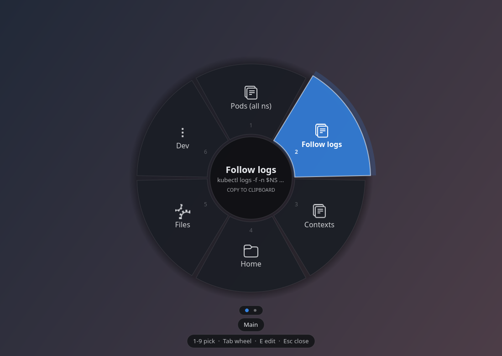

# qam — quick access menu

A weapon-select wheel for your desktop. Press **Alt+Q**, flick the mouse towards
a slice, let go of Alt. The thing you picked is on your clipboard, or open, or
running. Press **Alt+Q** again to put it away.

It exists for one specific annoyance: keeping a notes file full of commands you
have to go and find every time. Put them in a wheel once, and they are a flick
away for good.



## Install

qam is pure Python and needs nothing from PyPI — GTK4 arrives with GNOME and
`tomllib` ships with Python.

```sh
git clone <this repo> && cd qam
python3 -m qam install
```

That writes `~/.config/qam/config.toml`, installs a systemd user service, and
binds **Alt+Q** through GNOME's own keyboard shortcuts (visible and editable in
Settings → Keyboard). `python3 -m qam uninstall` reverses all of it.

Pick a different key with `python3 -m qam install --hotkey '<Super>space'`.

Check everything is wired up:

```sh
python3 -m qam doctor
```

## Using it

| Input | What it does |
|---|---|
| Point the mouse | Highlights the slice in that direction — distance doesn't matter, only direction |
| Release **Alt** | Picks the highlighted slice |
| Click | Picks a slice |
| **1**–**9** | Picks a slice directly |
| **← →** or scroll | Move the highlight |
| **Tab** | Next wheel (dots at the bottom show which) |
| **E** | Edit mode |
| **Alt+Q** again, **Esc**, or click the middle | Close without doing anything |

The centre of the wheel shows the full value of whatever you are pointing at,
so you can check before you commit.

## Filling the wheels

Either edit the file:

```sh
python3 -m qam edit          # opens ~/.config/qam/config.toml in $EDITOR
```

...or press **E** inside the wheel and edit slices in place — including
**Paste clipboard**, which is the fast way to get a command out of your
terminal and into a slot. Changes to the file are picked up immediately; no
restart.

```toml
[settings]
hotkey = "<Alt>q"
default_wheel = "main"
notify = true

[[wheel]]
id = "main"
name = "Main"

  [[wheel.item]]
  label = "Pods (all ns)"
  type = "snippet"
  value = "kubectl get pods -A"

  [[wheel.item]]
  label = "Notes"
  type = "path"
  value = "~/Documents/notes.md"
```

### Item types

| `type` | `value` | What happens |
|---|---|---|
| `snippet` | any text | Copied to the clipboard **and** the primary selection |
| `command` | a command | Run detached. Add `shell = true` for pipes and globs |
| `app` | `org.gnome.Nautilus.desktop` | Launches the app |
| `path` | `~/notes.md` | Opens it with the default handler |
| `uri` | `https://…` | Opens it |
| `wheel` | another wheel's `id` | Jumps to that wheel without closing |

Optional per item: `icon` (any icon name from the theme, e.g.
`utilities-terminal-symbolic`).

Optional in `[settings]`:

| Key | Default | Meaning |
|---|---|---|
| `accent` | your GNOME accent | Highlight colour, e.g. `"#e66100"` |
| `inner_radius` | `96` | Radius of the hub — also the dead zone |
| `outer_radius` | `250` | Outer radius of the wheel |
| `overlay_mode` | `"maximized"` | `maximized`, `fullscreen`, or `window` — see below |

Adding items from a script:

```sh
python3 -m qam add "kubectl get events -A --sort-by=.lastTimestamp" --label Events
history | tail -1 | python3 -m qam add - --wheel dev
```

Note: editing inside the wheel rewrites `config.toml`, which drops any comments
you have written in it. Edit the file by hand if you want to keep them.

## How it works, and why

- **Alt+Q is a GNOME keybinding, not a grab.** Wayland does not let an
  application take a global hotkey, so qam registers one with GNOME the same
  way the Settings app would. The shortcut runs `gdbus`, a small C binary that
  wakes the already-running daemon in a few milliseconds — spawning a Python
  interpreter per keypress would be felt as lag.
- **The window covers the screen but is almost entirely transparent.** Wayland
  gives an app no control over window placement and no way to read the global
  pointer, so owning a screen-sized surface is the only way to reliably centre
  the wheel and follow the mouse. Only the wheel is painted; your desktop shows
  through everywhere else.
- **It is maximized, not fullscreen.** GNOME composites nothing behind a true
  fullscreen surface, so a transparent one comes out black instead of showing
  the desktop. Maximizing covers the work area and composites normally. If your
  setup disagrees, set `overlay_mode` to `fullscreen` or `window`.
- **Selection is by direction, not position.** The wheel appears centred rather
  than under the cursor, so the same flick always picks the same slice, exactly
  like a gamepad wheel.
- **Hold-to-select is real.** GNOME only hands over a key *press*, but the
  overlay has focus by the time you let go, so the Alt *release* lands on qam
  and picks whatever you are pointing at. Tap Alt+Q instead and it stays open
  for the mouse or the number keys.
- **No Cairo, no dependencies.** Drawing goes through GTK's `Gsk` snapshot API,
  which is GPU-accelerated and needs no `python3-gi-cairo`.

## Other platforms

Everything OS-specific lives behind the `Platform` protocol in
`qam/platform/base.py`; the wheel, config and actions know nothing about the
desktop they run on. A Windows or macOS port is one new module in
`qam/platform/`.

## Development

```sh
python3 -m unittest discover -s tests -t .   # geometry and config
python3 -m qam daemon                        # run in the foreground
python3 -m qam show                          # open the wheel
python3 -m qam toggle                        # what the hotkey actually calls
```
